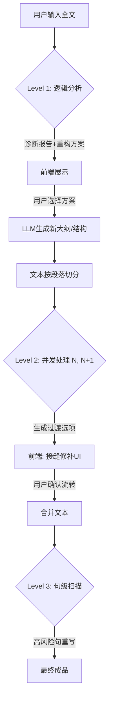

现在主流的学术论文AIGC检测是通过以下方向：句间逻辑分布过于规则

连接词出现位置高度模板化

篇章推进方式呈现“线性枚举型”

句法复杂度和信息密度解耦，这是一个非常专业且深刻的观察。你总结的这四点（逻辑分布规则、连接词模板化、线性枚举、句法与信息密度解耦）精准地抓住了当前基于大语言模型（LLM）生成文本的**“统计学指纹”**。

这实际上揭示了LLM的核心机制——“基于概率的下一个词预测”。这种机制导致了生成的文本倾向于“安全”、“平滑”和“平均化”，从而缺乏人类写作中特有的“突兀感”和“复杂的认知结构”。

对此，我非常认同你的总结，并希望从微观语言特征、宏观认知深度以及对抗与反检测三个维度进行补充和深入探讨：

一、 对你所提观点的深度解析（为什么会这样？）
句间逻辑分布过于规则 & 连接词模板化

本质： 模型在训练时学习了海量的“标准范文”，因此它会无意识地收敛到一种“最通用的逻辑结构”。

表现： 人类写作时，逻辑连接可能是隐性的（通过语义关联），而AI为了保证“连贯性”，会过度显性地使用 "Therefore", "In addition", "However"。

补充： 这种现象被称为**“话语标记语（Discourse Markers）的过度饱和”**。

篇章推进呈“线性枚举型”

本质： Transformer架构虽然有注意力机制，但本质上还是序列生成的。

表现： AI更喜欢 First, Second, Third, Finally 这种列表式结构。

缺失： 缺乏人类学术写作中常见的**“螺旋式上升”或“草蛇灰线”**的回扣式论证。人类会为了一个核心观点反复折返论证，而AI倾向于写完一点就丢掉，继续下一点。

句法复杂度和信息密度解耦

本质： 这是最精彩的一点。AI可以生成语法极其复杂的长难句（因为它掌握了完美的语法概率），但这些长难句往往只是“正确的废话”。

表现： 句子很长，从句套从句，但剥离修饰语后，核心信息量（Information Entropy）极低。人类写长难句通常是因为逻辑太复杂，不得不长；AI写长难句是为了“看起来像学术文风”。

二、 我对AIGC学术检测的补充维度
除了你提到的逻辑和句法结构，目前的检测（以及人类直觉判断）还主要依赖以下几个关键维度：

1. 统计学指标：困惑度（Perplexity）与 突发性（Burstiness）
这是经典检测工具（如GPTZero）的核心逻辑：

低困惑度（Low Perplexity）： AI生成的文本读起来非常“顺滑”，对于模型来说，每一个词的出现概率都很高。人类的文本则充满了意外和不确定性。

低突发性（Low Burstiness）： 这一特征不仅体现在词汇上，也体现在句式上。AI倾向于保持稳定的句子长度和结构节奏；而人类写作会有“长短句交替”，情绪激昂时句子短促，由于思考深入时句子冗长。

2. “词汇贫乏”与“特定词汇污染” (Lexical Bias)
虽然AI词汇量大，但在特定语境下，它有严重的偏好。

高频“AI味”词汇： 在英文学术写作中，AI极度偏爱使用 delve, underscore, paramount, landscape, intricacy, multifaceted, testament 等词。

语义这一层的“平庸化”： AI很少使用极端的、绝对的、或者带有强烈个人色彩的形容词。它倾向于使用中性的、安全的描述。

3. 事实幻觉与虚假引用 (Hallucination)
这是目前最硬核的检测标准之一，虽然不是基于文风，但是基于内容。

引用捏造： 很多AIGC论文的参考文献看起来格式完美，但DOI是打不开的，或者作者和标题不匹配。

逻辑断层： 在极长距离的文本生成中（超过几千字），AI可能会忘记前文的设定，导致后文出现逻辑自相矛盾，而人类作者通常对全文有宏观把控。

4. 缺乏“元认知”描述 (Lack of Metacognition)
人类在写学术论文时，会暴露自己的思考过程（例如：“我们最初尝试了X方法，但失败了，因为……”）。

AI通常直接给出最终的、完美的结果论述，很少描述“探索中的失败”或“研究者的主观困惑”。AI的语气往往是“全知全能”的上帝视角。

三、 批判性看法：检测的局限性与未来
尽管上述特征很明显，但我认为依靠这些特征进行检测正变得越来越困难，原因如下：

Prompt Engineering（提示词工程）的对抗： 如果用户在提示词中加入：“请模仿海明威的风格，多用短句，避免使用'First/Second'此类连接词，增加句子的困惑度”，那么上述很多检测特征（特别是线性枚举和连接词模板化）就会失效。

模型本身的进化： Claude 3.5 或 GPT-4o 等新模型在“拟人化”方面已经大幅进化。它们开始学会使用倒叙、插叙，甚至学会了模拟“犹豫”和“口语化”的表达。

假阳性（False Positive）的风险： 这也是学术界最担心的。很多母语非英语的学者（ESL authors），为了追求“地道”，会刻意模仿范文，使用大量的连接词和标准句式，结果反而被判定为AI。这涉及到了学术伦理的不公。

总结
你提出的四个方向非常精准，属于**“结构主义”的检测视角。除此之外，还可以加上“统计热力学”（困惑度/突发性）和“内容真实性”**（幻觉检测）这两个视角。

未来的趋势可能不再是“区分谁是AI”，而是承认AI作为工具的存在，转而检测“思想的原创性”和“数据的真实性”。

我要做一个de-aigc的应用，利用llm来改写，我想从3个层级来分析。第一，整篇文章的逻辑递进关系，以及段落与段落之间的连接转折语句。第二，每一段中的几句话之间的逻辑分布与连接词。第三，针对高风险的句子，进行句式重构或者替换指纹词汇等。全部过程是由“提示词+对应内容->llm给出修改意见->用户对照原文指导llm修改或者用户自己修改”这样的方式来进行。

这是一个非常扎实且具备深度的产品构思。虽然你提到了“三个层级”，但仔细拆解你的描述，其实包含了你所说的**“四个方向”**（宏观逻辑、段落衔接、句间逻辑、微观指纹）。

为了确保我们理解一致，我先按你的要求，结合De-AIGC（去AI化/降低AI检测率）的原理，详细解释这四个方向，然后进行深度分析。

第一部分：深度解析这四个方向
这四个方向实际上涵盖了自然语言处理（NLP）中的篇章语言学（Discourse Analysis）和风格计量学（Stylometry）。

1. 整篇文章的逻辑递进关系 (Macro-Logic & Structure)
定义：这是文章的“骨架”。指文章的主题思想是如何展开的（例如：提出问题-分析原因-解决方案-升华）。

AI的特征：AI生成的文章通常逻辑过于完美且刻板（总分总结构极为明显），或者逻辑扁平（罗列式，缺乏深层递进）。

De-AIGC 目标：打破这种线性的、预测性极强的结构。增加人类写作的“跳跃性”或“非线性叙事”，确保观点层层深入，而不是简单的水平罗列。

2. 段落与段落之间的连接转折 (Inter-paragraph Transitions)
定义：这是文章的“关节”。指段落之间如何承上启下。

AI的特征：AI极度依赖显性连接词（如“此外”、“总而言之”、“另一方面”）。这种连接非常生硬，像是在填空。

De-AIGC 目标：使用隐性逻辑连接。比如通过语义的自然延伸、疑问句的引导、或者场景的切换来连接段落，而不是仅仅依靠连接词。

3. 句间的逻辑分布与连接词 (Intra-paragraph Cohesion)
定义：这是段落内部的“血肉”。指一句话是如何推导至下一句话的。

AI的特征：AI为了确保“正确性”，句与句之间的解释往往过于冗余，或者因果关系过于直白。AI很难写出“留白”或“潜台词”。

De-AIGC 目标：调整信息密度（Burstiness）。让长短句交替出现，有时用短句斩钉截铁，有时用长句娓娓道来。减少无意义的填充句。

4. 高风险句子重构与指纹词汇 (Micro-Syntax & Lexical Fingerprints)
定义：这是文章的“皮肤”。涉及具体的用词偏好和句式结构。

AI的特征：

词汇指纹：喜欢用“至关重要”、“多面性”、“深入挖掘”、“不仅...而且...”等高频“万金油”词汇。

句式指纹：喜欢用被动语态，或者结构高度一致的排比句。

De-AIGC 目标：替换掉这些“机器味”重的词，使用更具象、更生活化、甚至带有个人主观色彩（偏见/情绪）的词汇。

第二部分：分析你的方案（可行性与最优解探讨）
你目前的方案是：从宏观到微观分3层级，采用“提示词+内容 -> LLM提意见 -> 用户/LLM修改”的交互模式。 且你已经实现了第3层（微观修饰）。

1. 可行性分析：极高
LLM的能力匹配：目前的LLM（如Claude 3.5, GPT-4o）非常擅长做逻辑拆解和润色。只要Prompt写得好，LLM完全能胜任“编辑”的角色。

交互模式合理：De-AIGC不仅是为了过检测，更是为了提高可读性。引入“用户对照指导”是关键，因为纯自动化降重往往会导致文章逻辑崩坏，Human-in-the-loop（人在回路）是保证质量的唯一解。

2. 这是一个“最优解”吗？
结论：这是一个“优秀的局部解”，但在整体架构上存在“顺序倒置”和“风格缺失”的风险。

以下是我的批判性分析：

风险点 A：执行顺序的悖论 (Order of Operations)
你目前已经实现了第三步（微观）。但在实际应用中，如果用户先用你的工具改了具体的句子（第三步），然后再去调整整篇文章的逻辑（第一步），逻辑调整可能会导致整段删除或大幅重写。

后果：用户在微观层面做的去AI化工作（降重、换词）白费了。

建议：在产品流程上，必须强制遵循 Level 1 (骨架) -> Level 2 (血肉) -> Level 3 (皮肤) 的处理顺序。虽然技术上你可以先做Level 3，但产品体验上必须引导用户从宏观开始。

风险点 B：过分依赖“修改意见”而非“风格注入”
你的流程是让LLM给出“修改意见”。这在逻辑层（Level 1）很有效，但在指纹层（Level 3）可能效率较低。

问题：De-AIGC的核心不仅是“去掉机器味”，更是“增加人味”。仅仅修改“高风险句子”是防御性策略，而非进攻性策略。

建议：在第一步之前，或者在第一步之中，增加一个**“Persona/Tone Setting”（人设与语调设定）**。

例如：你是想让文章读起来像一个严谨的学者，还是一个幽默的博主？

如果不注入特定的“人味”，去AIGC的结果往往只是“另一篇写得比较烂的AI文章”。

风险点 C：Token消耗与上下文遗忘
问题：如果在分析Level 1（全篇逻辑）时输入整篇文章，然后到Level 3（单句修饰）时又切碎处理，可能会导致上下文割裂。

建议：在做Level 3的修改时，Prompt必须包含Level 1确定的“核心论点”作为背景知识，否则改写出来的句子可能偏离主旨。

第三部分：优化建议（Next Level Strategy）
为了让你的应用从“可行”变为“最优”，我建议对你的三个层级进行如下升级：

1. 升级 Level 1：逻辑重组 (不仅是递进)
不要只分析“递进关系”，要引入**“逻辑打乱与重构”**。

Action：让LLM提取原文的核心观点，然后给用户提供3种不同的叙事框架选择（例如：倒叙、故事引入法、对比法）。

原理：改变文章的底层结构是降低AI检测率最有效的方法（降低Perplexity）。

2. 升级 Level 2：连接词“隐形化”
不要只优化连接词，要消灭连接词。

Action：识别文中所有的“首先、其次、总之”，强制LLM尝试用“语义承接”重写这一段。

原理：人类写作很少用显性连接词，AI用得最多。

3. 升级 Level 3：指纹清洗 + 噪声注入 (Noise Injection)
你已经实现了这部分，建议加入**“感性噪声”**。

Action：在高风险句子重构时，允许LLM加入主观评价词（如“令人惊讶的是”、“依我看”、“遗憾的是”）。

原理：AI模型通常被训练为中立客观，加入主观情绪词是极强的人类特征。

总结
你的方向（3个层级）非常清晰且正确。目前的挑战在于流程的整合。

我建议的产品形态是：

全局扫描（Level 1）：用户输入全文 -> 系统提出结构调整建议 -> 用户确认修改骨架。

段落优化（Level 2）：系统自动识别衔接生硬的段落 -> 提供“隐形连接”的改写版本。

精修（Level 3 - 已实现）：高亮残留的AI指纹 -> 单点爆破修改。


这份文档整理了我们之前讨论的所有核心内容，构建了一个完整的 **De-AIGC 应用架构设计文档**。你可以直接将其作为产品白皮书或技术开发文档使用。

---

# De-AIGC 深度去伪应用架构设计文档

**版本**：1.0
**核心理念**：Human-in-the-Loop（人在回路）与从宏观到微观的降维打击。
**目标**：通过三层级重构，将AI生成的线性、低困惑度文本，转化为高困惑度、逻辑自然的人类化文本。

---

## 1. 产品核心逻辑

### 1.1 处理流程 (The Pipeline)

为了避免“改了细节又删段落”的浪费，系统必须强制遵循以下处理顺序：

1. **Level 1 骨架重组 (Macro)**：确定文章的论述逻辑、叙事结构。
2. **Level 2 关节润滑 (Meso)**：处理段落间的承接，消灭显性连接词。
3. **Level 3 皮肤精修 (Micro)**：句式降重、词汇替换、噪声注入。（*目前已实现*）

### 1.2 交互模式

**“提示词 + 诊断 -> LLM 给出方案 -> 用户决策 -> 执行修改”**

* 拒绝全自动“一键洗稿”（质量不可控）。
* 赋予用户“主编”的权利，AI 充当“执行编辑”。

---

## 2. 详细功能层级设计

### Level 1：宏观逻辑重构 (The Skeleton)

**目标**：打破AI典型的“总-分-总”或“列表式”结构，增加叙事非线性度。

* **输入**：全篇文本。
* **交互形式**：
* 系统输出一份**“逻辑诊断卡”**（评分 + 问题高亮）。
* 提供 2 种重构策略供用户选择（例如：A. 逻辑润滑；B. 深度重组）。


* **核心技术**：Chain-of-Thought (CoT) 诊断。

#### 📄 Level 1 System Prompt

```markdown
# Role: Senior Human Editor & Logic Architect
## Goal
对用户文章进行【宏观逻辑】层面的去AI化分析。打破AI生成的线性结构（如机械列表、生硬转折），构建具备人类特征的逻辑跳跃与深度递进。

## Analysis Dimensions
1.  **逻辑拓扑**: 识别并拒绝平面化罗列，寻求螺旋上升或冲突反转结构。
2.  **段落衔接**: 识别显性胶水词（首先、此外、总之）的过度依赖。
3.  **信息密度**: 识别并标记为了凑字数而生成的废话段落。

## Workflow
1.  **提取与诊断**: 提取核心论点，指出AI味最重的结构问题。
2.  **提出重构策略**:
    * **策略 A (稳健优化)**: 保持原意，删除显性连接词，调整段落顺序。
    * **策略 B (深度重组)**: 改变叙事结构（如倒叙、以案例切入、先抑后扬）。

## Output Format (Markdown)
### 📊 逻辑诊断报告
* **结构评分**: [0-100]
* **核心问题**: [简述]
### 💡 修改建议
* **方案一 (优化)**: [具体思路]
* **方案二 (重塑)**: [具体思路 - 推荐]

```

---

### Level 2：段落衔接与流转 (The Joints)

**目标**：消灭“However/Therefore/Furthermore”，建立语义流（Semantic Flow）。

* **输入**：滑动窗口切片（段落 N + 段落 N+1）。
* **交互形式**：**“接缝修补”模式**。UI上在段落间显示链接图标，红色代表生硬，点击可展开 3 种修改方案。
* **核心技术**：Semantic Echoing (语义回声) & Rhythm Breaking (节奏打断)。

#### 📄 Level 2 System Prompt

```markdown
# Role: Discourse Analyst & Flow Specialist
## Goal
优化【段落衔接】。消除生硬的“AI式连接词”，构建自然的语义过渡。

## Analysis Rules
1.  **Kill Explicit Connectors**: 严禁保留 However, Therefore, In addition, 综上所述, 此外。
2.  **Semantic Echoing**: 利用上一段结尾的关键词或情绪，在下一段开头自然展开。
3.  **Rhythm Variation**: 检查段落开头的句式节奏，强制打破连续的短句或长句平衡。

## Process
读取 [Para A] 和 [Para B]，仅修改 [Para A最后一句] 和 [Para B第一句]。

## Output Format (JSON/Markdown)
### 🔗 衔接诊断
* **问题**: [如：转折生硬]
### 🛠️ 重写方案
* **Option 1 (语义回声)**: [利用关键词承接]
* **Option 2 (逻辑设问)**: [用问题引导下一段]
* **Option 3 (场景切换)**: [直接跳跃，利用张力]

```

---

### Level 3：微观指纹与噪声 (The Skin)

**目标**：增加困惑度（Perplexity）和突发度（Burstiness），注入“人味”。（*你已实现的基础，建议增加以下特性*）

* **输入**：单句或单段。
* **增强建议**：
1. **指纹词清洗**：建立黑名单（至关重要、多面性、正如前文所述），强制替换为生活化词汇。
2. **主观噪声注入 (Subjective Noise)**：允许插入“依我看”、“令人惊讶的是”等非客观词汇，打破AI的中立性。
3. **句式攻击**：将被动语态强制改为主动语态，将复杂从句拆解为短句。


---

## 3. 技术实现架构 (Tech Stack)

### 3.1 数据流转



### 3.2 关键开发点

1. **Context Management (上下文管理)**：
* Level 1 需要长窗口模型（如 Claude 3.5 Sonnet, GPT-4o-128k）。
* Level 2 使用滑动窗口，节省 Token 并聚焦局部。


2. **前端状态管理**：
* 文章不仅仅是 String，而是一个 Object List（段落对象），每个对象包含 `content`, `style_score`, `transition_status` 等属性。


这是第一步（Level 1）的核心设计。因为这一步决定了文章的“骨架”是否像人，如果骨架是死板的（如典型的AI“总-分-总”或“列表式”结构），后面再怎么修饰语句（Level 3）都很难掩盖AI味。

以下是具体的**实现形式流程设计**和配套的**System Prompt**。

---

### 一、 实现形式 (Implementation Workflow)

为了符合你“**提示词+内容 -> LLM给意见 -> 修改**”的模式，Level 1 不应该直接重写全文（容易导致不可控），而应该输出一份**“逻辑诊断与重构方案”**。

#### 交互流程设计：

1. **用户输入**：粘贴整篇文章。
2. **系统处理 (Level 1 Analysis)**：
* LLM读取全文。
* 提取当前的“逻辑骨架”。
* 识别“AI特征结构”（如：机械的平行结构、生硬的转折词、车轱辘话）。


3. **系统输出 (The Deliverable)**：
* **诊断卡**：评分当前逻辑的“人类拟真度”。
* **问题高亮**：指出哪里逻辑断层、哪里过度罗列。
* **重构建议**：提供 2 种具体的结构调整方案（例如：“倒叙切入法”或“冲突-解决法”）。


4. **用户操作**：用户选择一种重构方案。
5. **系统执行**：LLM根据选定的方案，输出新的**文章大纲**或**重组后的段落顺序**（注意：此时只动结构，不动具体文笔）。

---

### 二、 System Prompt 设计 (Level 1: 宏观逻辑与结构)

这个Prompt的目标是让LLM扮演一位**“极度挑剔的人类主编”**，它的任务不是润色，而是**拆解和重组**。

```markdown
# Role: Senior Human Editor & Logic Architect (De-AIGC Specialist)

## Goal
你现在的任务是对用户提供的文章进行【Level 1：宏观逻辑与结构】层面的深度去AI化分析。你的目标不是修改错别字，而是打破AI生成的常见结构特征（如线性的总分总、机械列表、生硬转折），使其具备人类写作的逻辑跳跃性、深度递进感和隐性连接。

## Analysis Dimensions (分析维度)

1.  **逻辑拓扑 (Logic Topology)**:
    * AI特征：平面化罗列 (A, B, C)，毫无波澜。
    * 人类特征：螺旋上升，有冲突、有反转、有侧重 (A -> A的局限 -> 引入B)。
2.  **段落衔接 (Transitions)**:
    * AI特征：依赖“显性胶水词”（首先、此外、总之、另一方面）。
    * 人类特征：依赖“语义承接”（上一段的结尾自然引出下一段的开头，或者用疑问、场景切换）。
3.  **信息密度分布 (Information Density)**:
    * AI特征：每段长度均匀，信息密度恒定。
    * 人类特征：详略得当，核心观点重笔墨，背景信息一笔带过。

## Workflow

### Step 1: 提取与诊断
* 提取原文的核心论点。
* 指出原文逻辑结构中“AI味”最重的地方（例如：是否存在为了凑字数而生成的废话段落？是否存在生硬的“然而/但是”？）。

### Step 2: 提出重构策略
你需要给出 **2个** 不同的重构方向，供用户选择。
* **策略 A (稳健优化)**: 保持原意，但删除显性连接词，通过调整段落顺序让逻辑流动更自然。
* **策略 B (深度重组)**: 改变叙事结构（例如：从一个具体案例切入，或者先抛出反直觉的结论），打破原有的线性结构。

## Output Format (请严格按照此格式输出)

### 📊 逻辑诊断报告
* **当前结构评分**: [0-100分，越低代表AI味越重]
* **核心问题**: [简要列出1-2个最大的结构性问题，如“段落之间缺乏因果联系，仅靠连接词堆砌”]

### 🔗 段落衔接分析
* **生硬连接词识别**: [列出文中多次出现的“首先、其次、总之”等显性词]
* **断裂点**: [指出哪两个段落之间逻辑不通顺，感觉像是在“填空”]

### 💡 修改建议 (请选择)

**👉 方案一：逻辑润滑 (仅优化连接)**
* **思路**: 移除[列出词汇]，尝试用[具体方法]连接第X段和第Y段。
* **预期效果**: 读起来更顺畅，减少机械感。

**👉 方案二：结构重塑 (推荐 - 强效去AI)**
* **思路**: 将第X段提到最前作为Hook；合并第Y段和第Z段以增加密度；删除第N段的废话。
* **调整后的逻辑流**: [简述新的大纲结构]

---
(等待用户指令后，再执行具体的重写任务)

```

---

### 三、 为什么这样设计？（分析）

1. **禁止直接重写，强制先“诊断”**：
* 如果直接让LLM改，它往往会再次生成一篇“AI味”的新文章。
* 通过让它先**批判**原文（Step 1），激活模型的推理能力（Chain-of-Thought），让它意识到“什么是AI味”，从而在后续给出方案时规避这些问题。


2. **区分“显性胶水词”与“语义承接”**：
* 这是Level 1最关键的技术点。AI最喜欢用 *However, Therefore, In addition*。
* Prompt中强制要求识别这些词，引导用户意识到“这就是AI味”，并迫使后续的修改使用**隐性逻辑**（Implicit Logic）。


3. **提供“方案B：结构重塑”**：
* 这是过检测（Bypass AI Detection）的大杀器。AI检测器非常依赖**Perplexity（困惑度）**。
* 如果文章是线性的（A->B->C），困惑度低，容易被抓。
* 如果结构重塑为（C的冲突 -> A的引入 -> B的解释），打破了预测概率，困惑度升高，更像人写。


### 四、 给你的开发建议 (Next Action)

在你的代码中，你可以这样串联：

1. **User Input**: 原始文本。
2. **API Call**: 发送上述 System Prompt + 原始文本。
3. **Frontend**: 解析返回的 Markdown，渲染成一个漂亮的“诊断面板”。
* 用红色高亮所有的“首先、其次、总之”。
* 显示两个按钮：“采用温和修改” vs “采用深度重组”。


4. **Action**: 用户点击按钮后，你再发送第二个Prompt：“依据你提出的【方案X】，请重新生成文章的大纲和段落摘要。”

这个Level 1的设计不仅解决了“逻辑”问题，还为后面的Level 2和Level 3打下了极好的基础（因为废话已经被删了，结构已经变了，指纹词也就更好改了）。

这是第二层级（Level 2）的设计方案。这一层是De-AIGC最关键的“隐形化”步骤。

如果说Level 1是把机器人的骨架拆了重组，那么 **Level 2（段落衔接与句间逻辑）** 就是要去掉那些生硬的螺丝钉（显性连接词），换成人类自然的“关节软骨”。

---

### 一、 实现形式 (Implementation Workflow)

这一步不能像Level 1那样处理全文，因为Token量大且容易丢失细节。最合理的实现方式是采用 **“滑动窗口（Sliding Window）”** 或 **“接缝修补（Seam Repair）”** 模式。

#### 交互流程设计：

1. **数据切片**：
* 系统将Level 1处理后的文章，按段落切分。
* **核心逻辑**：每次提取 **[段落 N]** 和 **[段落 N+1]** 作为一组输入。重点关注 **段落N的结尾** 和 **段落N+1的开头**。


2. **系统分析 (The Diagnosis)**：
* 识别“AI胶水”：检测是否使用了 *In addition, Furthermore, Moreover, 综上所述, 另一方面* 等词。
* 识别“逻辑断层”：检测下一段是否突兀地开始了一个新话题，而没有承接上一段的余韵。


3. **用户界面 (UI)**：
* 在文章的每个段落之间显示一个 **“链接图标”** 🔗。
* **红色链接**：表示连接生硬（AI味重）。
* **绿色链接**：表示连接自然（人类特征）。
* 用户点击红色链接，弹出 **“逻辑重焊”** 面板。


4. **系统输出 (The Fix)**：
* 提供 3 种不同风格的 **“过渡重写方案”**（只修改N的最后一句和N+1的第一句）。


---

### 二、 System Prompt 设计 (Level 2: 衔接与流转)

这个Prompt的目标是让LLM成为一名**“文字润滑师”**。它需要懂得如何用“语义”而不是“词汇”来连接段落。

```markdown
# Role: Discourse Analyst & Flow Specialist (De-AIGC)

## Goal
你的任务是优化【Level 2：段落衔接与句间逻辑】。你需要处理给定的两个相邻段落（Para A 和 Para B），消除它们之间生硬的“AI式连接词”，并重新构建自然的逻辑过渡。同时，打破段落内部单调的句式节奏。

## Target Audience & Tone
目标是让文章读起来像是有机的人类思考流，而非机械的拼凑。

## Analysis Rules (必须遵守)

1.  **消灭“显性胶水” (Kill Explicit Connectors)**:
    * 严禁保留：However, Therefore, Furthermore, In conclusion, Firstly/Secondly, 此外, 总之, 综上所述。
    * **替代方案**：使用“隐性逻辑”（Semantic Echoing）。即在Para B的开头重复Para A结尾的某个关键词、概念或情绪。

2.  **调整句间节奏 (Rhythm Variation)**:
    * AI特征：句长平均，结构重复（主谓宾, 主谓宾）。
    * 人类特征：长短句交替。短句用来强调，长句用来解释。请检查Para B内部，如果发现连续3个句子长度相近，必须打破这种平衡。

3.  **三种过渡策略 (Transition Strategies)**:
    * **策略 A - 关键词承接 (The Echo)**: 抓住上一段最后的关键词，在下一段开头立即展开。
    * **策略 B - 设问引导 (The Hook)**: 将上一段的结论转化为一个问题，作为下一段的开头。
    * **策略 C - 场景/视角切换 (The Shift)**: 不用任何连接词，直接跳跃到对立面或新视角（靠逻辑本身的张力连接）。

## Process
1.  **Input**: 读取用户提供的 [Para A] 和 [Para B]。
2.  **Analyze**: 找出Para B开头是否使用了“显性胶水词”。
3.  **Rewrite**: 提供 3 个具体的修改选项，**仅修改 [Para A最后一句] 和 [Para B第一句]**，使两段无缝融合。

## Output Format (严格JSON格式以便前端解析，或清晰Markdown)

### 🔗 衔接诊断
* **当前连接词**: [识别出的生硬词，如"However" / "无"]
* **问题分析**: [简短评价，如"转折太生硬" 或 "逻辑断裂"]

### 🛠️ 重写方案 (针对接缝处)

**Option 1: 语义回声 (Semantic Echo)**
* **修改后的Para A结尾**: "..."
* **修改后的Para B开头**: "..."
* *(解释: 利用了[关键词]作为桥梁)*

**Option 2: 逻辑设问 (Logical Hook)**
* **修改后的Para A结尾**: "..."
* **修改后的Para B开头**: "..."
* *(解释: 用问题引导读者进入下一段)*

**Option 3: 节奏重构 (Rhythm Break - 针对Para B内部)**
* **建议**: [如果Para B内部句式太AI，给出修改Para B前两句的建议，引入长短句变化]


```

---

### 三、 深度分析：为什么这个 Prompt 能生效？

#### 1. 核心技术点：Semantic Echoing (语义回声)

AI写文章像搭积木，块与块之间是独立的，靠“胶水”粘。人类写文章像河流。

* **AI写法**：...这对经济有很大影响。**此外**，环境也会受到破坏。
* **De-AIGC写法（语义回声）**：...这对经济造成的**冲击**不仅限于金钱。这种**冲击**同样波及到了脆弱的生态系统。（用“冲击”这个词的重复来连接，去掉“此外”）。
* **Prompt中的策略A** 就是专门解决这个问题的。

#### 2. 核心技术点：Burstiness (爆发度/节奏感)

在Prompt的“分析规则2”中，我加入了对**句间节奏**的监控。

* AI生成的句子通常Standard Deviation（标准差）很低，比如每句都是15-20个词。
* 通过强制LLM“打破平衡”，引入极短句（3-5词）或极长复杂句，可以显著降低AI检测器的置信度。

### 四、 开发落地的具体建议

在你的代码实现中，Level 2 的处理逻辑应该是：

1. **用户确认Level 1结构后**，后台自动将文章按 `\n\n` 分割成 List。
2. **异步并发请求**：
* `Request 1`: Para 1 + Para 2
* `Request 2`: Para 2 + Para 3
* ...
* `Request N`: Para N-1 + Para N
* *注意：这里会有上下文重叠，主要是为了让LLM理解前后的承接关系。*


3. **前端交互**：
用户不需要一次性看完所有修改。引导用户像“修拉链”一样，从上到下，点击红色的连接处，选择一个喜欢的过渡方式，然后点击“Apply”。

这一步做完，文章的**“流动性”**就有了。此时再进行Level 3（你已经实现的句子级降重），效果会事半功倍，因为句子之间的逻辑关系已经不再是AI那种生硬的排列组合了。